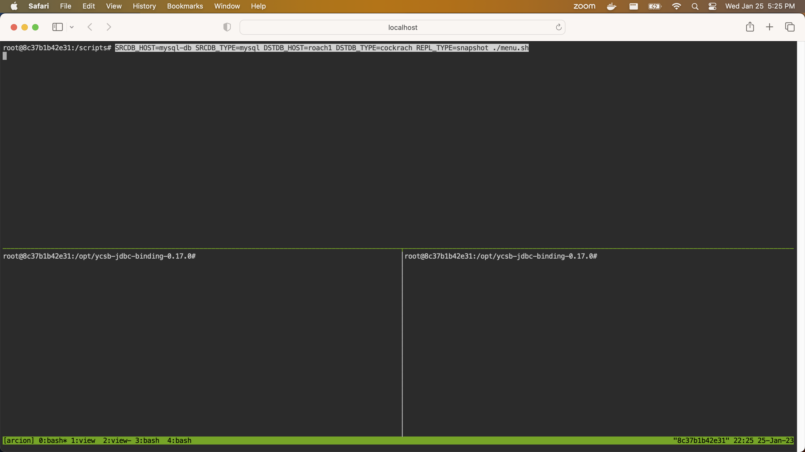

This assumes base environment is already setup from the [README.md](README.md).

NOTE: CockroachDB as the source using snapshot replication mode works.  All other uses do not work in all cases for now.  See the test cases below for the coverage.  

- Start CockroachDB

This is a copy/paste from [Start a Cluster in Docker (Insecure) in Mac](https://www.cockroachlabs.com/docs/stable/start-a-local-cluster-in-docker-mac.html) with the following change(s):
  - use `arcnet` instead of `roachnet`

```
docker volume create roach1
docker volume create roach1
docker volume create roach1

docker run -d \
--name=roach1 \
--hostname=roach1 \
--net=arcnet \
-p 26257:26257 -p 8080:8080  \
-v "roach1:/cockroach/cockroach-data"  \
cockroachdb/cockroach:v22.2.3 start \
--insecure \
--join=roach1,roach2,roach3

docker run -d \
--name=roach2 \
--hostname=roach2 \
--net=arcnet \
-v "roach2:/cockroach/cockroach-data" \
cockroachdb/cockroach:v22.2.3 start \
--insecure \
--join=roach1,roach2,roach3

docker run -d \
--name=roach3 \
--hostname=roach3 \
--net=arcnet \
-v "roach3:/cockroach/cockroach-data" \
cockroachdb/cockroach:v22.2.3 start \
--insecure \
--join=roach1,roach2,roach3

docker exec -it roach1 ./cockroach init --insecure
```    

- Use the CLI [http://localhost:7681](http://localhost.7681)

# Running the CLI demo

- Open a browser with tabs for [Arcion](http://localhost:7681) and [tumx](http://localhost:7681)

In the first panel that pops up, Ctl-C and type the following:

```
SRCDB_HOST=roach1 SRCDB_TYPE=cockroach DSTDB_HOST=mysql-db-2 DSTDB_TYPE=mysql REPL_TYPE=snapshot ./menu.sh
```


The following combinations do not work as of yet.  The configs can be viewed via the `tmux` windows 1 and error messages `tmux` windows 2.

```
SRCDB_HOST=mysql-db SRCDB_TYPE=mysql DSTDB_HOST=roach1 DSTDB_TYPE=cockroach REPL_TYPE=snapshot ./menu.sh

SRCDB_HOST=mysql-db SRCDB_TYPE=mysql DSTDB_HOST=roach1 DSTDB_TYPE=cockroach REPL_TYPE=full ./menu.sh
```
