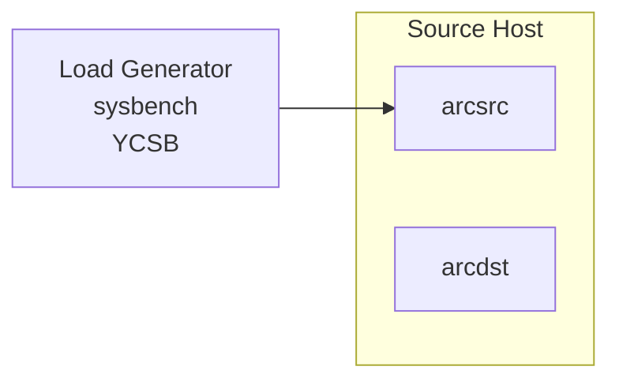
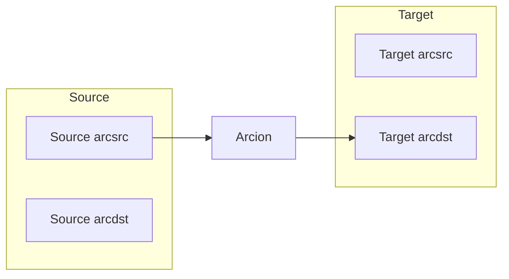
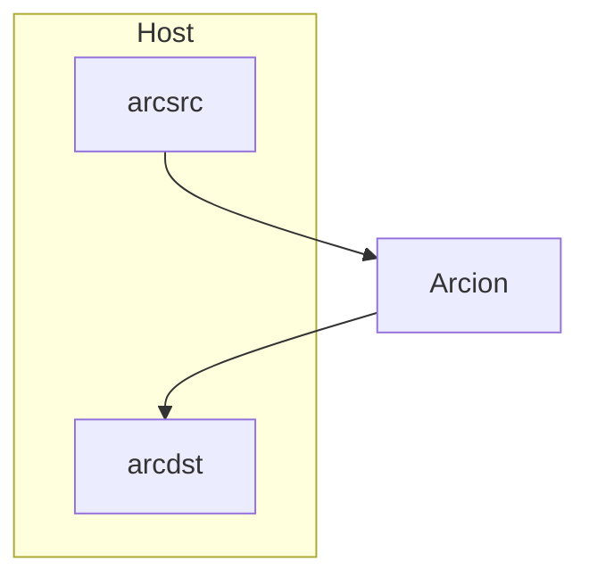

This has more explnation about the demo kit.

A host has two database and two user IDs.  The Load Generator is setup to use `arcsrc` username and write to `arcsrc` database.

Data is replicated from `arcsrc` to `arcdst` database.

Source and Target can be the same host. `arcsrc` database is replicated to `arcdst` database.

