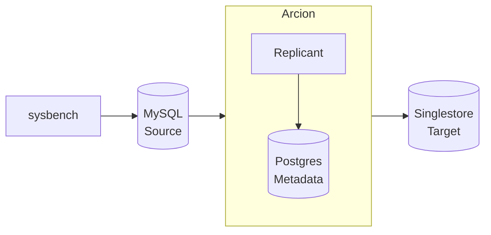

Arcion Replicant demos. This is a step by step instructions that uses:

- [Arcion Replicant w/GUI](https://docs.arcion.io/docs/arcion-cloud-dashboard/quickstart/index.html) 
- [sysbench](https://github.com/akopytov/sysbench) for generating OLTP workload on the source database 
- [ycsb](https://github.com/brianfrankcooper/YCSB) for generating massive load on the source database 
- [MySQL](https://www.mysql.com/) for the source database
- [Postgres](https://www.postgresql.org/) for Arcion's metastore
- [SingleStore](https://www.singlestore.com/) the target database

The diagram below depicts the data flow:


# Prerequisite

- Docker

Install [Docker Desktop](https://docs.docker.com/desktop/) and [Docker Compose](https://docs.docker.com/compose/).

- Clone this script

```
git clone https://github.com/robert-s-lee/arcion-demo
cd arcion-demo
```

- Arcion Trial License

Obtain [Arcion demo license](https://www.arcion.io/#) and save as licenses/arcion/arcion.lic.  The license would look like this

```
mkdir -p licenses/arcion
export ARCION_LIC_DIR=`pwd`/license/arcion
cat $ARCION_LIC_DIR/replicant.lic
{
  "license" : {
    "uuid" : "xxxxxxxxxxxxxxxx",
    "owner" : "Arcion-28122022",
    "created" : "2022-12-28T00:00Z",
    "expires" : "2023-01-27T00:00Z",
    "type" : "ONLINE",
    "edition" : "ENTERPRISE",
    "src" : [ "ALL" ],
    "dst" : [ "ALL" ]
  },
  "key" : "xxxxxxxxxxxxxxxxxxxxxxxxxxxxxxxxxxxxxxxxxxxxxxxx"
}
```

- SingleStore Trial License

Obtain [Singlestore Standard trial license](https://www.singlestore.com/self-managed-standard/)

```
mkdir -p licenses/singlestore
cat licenses/singlestore/singlestore.lic
export SINGLE_STORE_LIC="xxxxxxxxxxxxxxxx"
```

- verify the following are set
```
echo $ARCION_LIC_DIR
echo $SINGLE_STORE_LIC
```

# Start the Docker containers

```
docker-compose -f acrion-mysql-s2-compose.yaml up
```
# Arcion snapshot replication demo

Follow the [Arcion Cloud Tutorial](https://docs.arcion.io/docs/arcion-cloud-dashboard/quickstart/index.html)

# Arcion full replication demo
  
start the bench insert, update, delete

- open [localhost:7681](http://localhost:7681) 

- to generate sysbench workload

```
sysbench oltp_read_write --mysql-host=mysql1 --auto_inc=off --db-driver=mysql --mysql-user=sbt --mysql-password=password --mysql-db=sbt --report-interval=1 --time=60 --threads=1 run                                                                  
```

- to genewrate ycsb workload

```
bin/ycsb.sh run jdbc -s -P workloads/workloada -p db.driver=com.mysql.jdbc.Driver -p db.url="jdbc:mysql://mysql1/ycsb" -p db.user=ycsb -p db.passwd="password" -p db.batchsize=1000  -p jdbc.fetchsize=10 -p jdbc.autocommit=true -p db.batchsize=1000 -p recordcount=100000 -p operationcount=10000
```

# monitor databases

- the count and sum should match when the load is done. the sum should not match while the load is still running
```
mysql -hmysql1 -usbt -ppassword -Dsbt -e 'select count(*) from sbtest1; select sum(k) from sbtest1;'
mysql -hsinglestore -uroot -ppassword  -Dsbt -e 'select count(*) from sbtest1; select sum(k) from sbtest1;'
```

# Test coverage

| Workload | Replication Mode | Write Mode | source | target | 
| -- | -- | -- | -- | -- |
| sysbench | snapshot | Replacing | mysql | singlesstore 
| sysbench | full | Replacing | mysql | singlesstore

# Common issues

## license 

- license file not present
- license file not valid
- license expired

## replication topology 

- can not change from snap to full.  will stay in full
- can have 2nd snapshot to the same source
- cannot have 2nd full to the same source 
```
02:53:48.507 [pool-31-thread-1] [replicant] ERROR t.r.db.jdbc.mysql.MySQLCDCExtractor - binlogger error message: ERROR: Got error reading packet from server: A slave with the same server_uuid/server_id as this slave has connected to the master; the first event 'binlog.000002' at 119263798, the last event read from './binlog.000002' at 126, the last byte read from './binlog.000002' at 119263798.
```