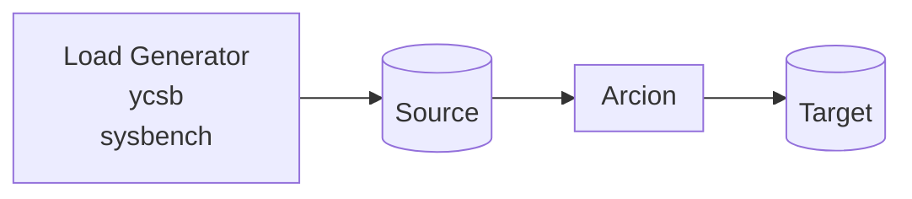

This is [Arcion](https://www.arcion.io/) Replicant demos using [CLI](https://docs.arcion.io/docs/quickstart/index.html) and [GUI](https://docs.arcion.io/docs/arcion-cloud-dashboard/quickstart/index.html).

# Overview
The diagram below depicts the components of the demo.


# CLI Demo Instructions

[asciinema](https://asciinema.org/a/554683) of typing the below commands.

- Get Arcion License

```bash
export ARCION_LICENSE=$(cat replicant.lic | base64)
if [ -z "$ARCION_LICENSE" ]; then echo "ERROR: ARCION_LICENSE is blank"; fi
```

- Save Arcion License for reuse
```bash
if [ -z "$( grep '^ARCION_LICENSE=' ~/.zshrc )" ]; then echo "ARCION_LICENSE=${ARCION_LICENSE}" >> ~/.zshrc; fi
```

Make sure $ARCION_LICENSE is not blank.

- Create Docker network
```bash
docker network create arcnet
```

- Start MySQL source and target

For OSX and Linux:

```bash
docker run -d \
    --name mysql-db \
    --network arcnet \
    -e MYSQL_ROOT_PASSWORD=password \
    -p :3306 \
    mysql \
    mysqld --default-authentication-plugin=mysql_native_password

docker run -d \
    --name mysql-db-2 \
    --network arcnet \
    -e MYSQL_ROOT_PASSWORD=password \
    -p :3306 \
    mysql \
    mysqld --default-authentication-plugin=mysql_native_password
```    

For the Windows users, use the single line version of the above

`docker run -d --name mysql-db --network arcnet -e MYSQL_ROOT_PASSWORD=password  -p :3306 mysql mysqld --default-authentication-plugin=mysql_native_password`

`docker run -d --name mysql-db-2 --network arcnet -e MYSQL_ROOT_PASSWORD=password  -p :3306 mysql mysqld --default-authentication-plugin=mysql_native_password`

- Start Arcion

For OSX and Linux:

```bash
docker run -d --name arcion-demo \
    --network arcnet \
    -e ARCION_LICENSE=${ARCION_LICENSE} \
    -p 7681:7681 \
    robertslee/sybench
```    

For the Windows users, use the single line version of the above:

```bash
docker run -d --name arcion-demo --network arcnet -e ARCION_LICENSE=${ARCION_LICENSE}  -p 7681:7681 robertslee/sybench
```

- Use the CLI [http://localhost:7681](http://localhost.7681)

# Running the CLI demo

Open a browser with tabs for [Arcion CLI](http://localhost:7681)

[tmux](https://man7.org/linux/man-pages/man1/tmux.1.html) is used in this console. Useful `tmux` commands are:

  - Ctrl + b + 0 for the main console windows.
  - Ctrl + b + 1 for the Arcion YAML files.
  - Ctrl + b + 2 for the Arcion trace and error files.
  - Ctrl + b + `<up arrow>` to move up the pane.
  - Ctrl + b + `<down arrow>` to move down the pane.
 
In the console windows, type the following for fully automated mode.


- run mysql source and target with Arcion snapshot mode
```bash
SRCDB_HOST=mysql-db SRCDB_TYPE=mysql DSTDB_HOST=mysql-db-2 DSTDB_TYPE=mysql REPL_TYPE=snapshot ./menu.sh
```
- run mysql source and target with Arcion real-time mode
```bash
SRCDB_HOST=mysql-db SRCDB_TYPE=mysql DSTDB_HOST=mysql-db-2 DSTDB_TYPE=mysql REPL_TYPE=real-time ./menu.sh
```
- run mysql source and target with Arcion real-time mode
```bash
SRCDB_HOST=mysql-db SRCDB_TYPE=mysql DSTDB_HOST=mysql-db-2 DSTDB_TYPE=mysql REPL_TYPE=full ./menu.sh
```
  NOTE: This mode does not stop.  type `pkill java` to stop the process.

- run in interactive mode where system asks for source and target
```bash
unset SRCDB_HOST SRCDB_TYPE DSTDB_HOST DSTDB_TYPE REPL_TYPE; cd /scripts; ./menu.sh
```
# view Conole, Cfg and Logs

- Console View after successful run


- Ctrl + b + 1 for the Arcion YAML files.

Use [vi](https://manpages.ubuntu.com/manpages/xenial/man1/nvi.1.html) to navigate. 


- Ctrl + b + 2 for the Arcion trace and error files.

Use [vi](https://manpages.ubuntu.com/manpages/xenial/man1/nvi.1.html) to navigate. 

