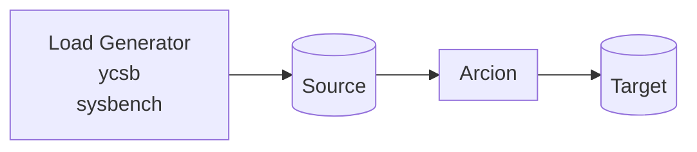

This is [Arcion](https://www.arcion.io/) Replicant demos using [CLI](https://docs.arcion.io/docs/quickstart/index.html) and [GUI](https://docs.arcion.io/docs/arcion-cloud-dashboard/quickstart/index.html).

# Overview
The diagram below depicts the components of the demo.


# CLI Demo Instructions

- Get Arcion License

```bash
export ARCION_LICENSE=$(cat replicant.lic | base64)
if [ -z "$( grep '^ARCION_LICENSE=' ~/.zshrc )" ]; then echo "ARCION_LICENSE=${ARCION_LICENSE} >> ~/.zshrc; fi
```

- Create Docker network
```bash
docker network create arcnet
```

- Start MySQL source and target
```bash
docker run -d \
    --name mysql-db \
    --network arcnet \
    -e MYSQL_ROOT_PASSWORD=password \
    -p :3306 \
    mysql \
    mysqld --default-authentication-plugin=mysql_native_password

docker run -d \
    --name mysql-db-2 \
    --network arcnet \
    -e MYSQL_ROOT_PASSWORD=password \
    -p :3306 \
    mysql \
    mysqld --default-authentication-plugin=mysql_native_password
```    

- Start Arcion
```bash
docker run -d \
    --name arcion-demo \
    --network arcnet \
    -e ARCION_LICENSE=${ARCION_LICENSE} \
    -e SRCDB_HOST=mysql-db \
    -e DSTDB_HOST=mysql-db-2 \
    -e SRCDB_TYPE=mysql \
    -e DSTDB_TYPE=mysql \
    -p 7681:7681 \
    robertslee/sybench
```    

- Use the CLI [http://localhost:7681](http://localhost.7681)

# Running the CLI demo

- Open a browser with tabs for [Arcion](http://localhost:8080) and [tumx](http://localhost:7681)


- In the `Arcion` tab, follow the [Arcion Cloud Tutorial](https://docs.arcion.io/docs/arcion-cloud-dashboard/quickstart/index.html)
- In the `tmux` tab, type the following commands for `sysbench` and `ycsb` workloads respectively.  Useful `tmux` commands are:

  - Ctrl + b + % to split the current pane vertically.

  - Ctrl + b + " to split the current pane horizontally.

  - Ctrl + b + x to close the current pane.

  - Ctrl + b + `<up arrow>` to move up the pane.

  - Ctrl + b + `<down arrow>` to move down the pane.

  - Ctrl + s to connect to a different session.
  
  Below are the commands on each of the panes assuming `Ctl + b + "` was used three times to create three panes.

```
/scripts/sysbench.sh
/scripts/ycbs.sh
dstat
```

