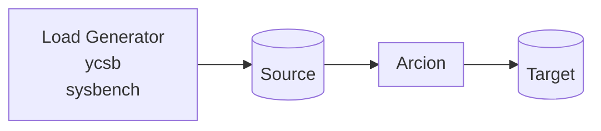

This is [Arcion](https://www.arcion.io/) Replicant demos using [CLI](https://docs.arcion.io/docs/quickstart/index.html) and [GUI](https://docs.arcion.io/docs/arcion-cloud-dashboard/quickstart/index.html).

# Overview
The diagram below depicts the components of the demo.


# CLI Demo Instructions

[asciinema](https://asciinema.org/a/554683) of typing the below commands.

Instructions for MySQL source and various target databases:

Works

- MySQL to MySQL below
- [MariaDB to MariaDB](./README.mariadb.md) 
- [SingleStore to SingleStore](./README.singlestore.md) 
- [Postgresql to Postgresql](./README.postgres.md) 


## Step by Step Process

- Get Arcion License

Make sure $ARCION_LICENSE is not blank and is valid

```bash
export ARCION_LICENSE="$(cat replicant.lic | gzip -9 | base64)"
if [ -z "${ARCION_LICENSE}" ]; then echo "ERROR: ARCION_LICENSE is blank"; fi
echo "${ARCION_LICENSE}" | base64 -d | gzip -d
```

- Save Arcion License for reuse
```bash
if [ -z "$( grep '^export ARCION_LICENSE=' ~/.zshrc )" ]; then echo "export ARCION_LICENSE=${ARCION_LICENSE}" >> ~/.zshrc; fi
if [ -z "$( grep '^export ARCION_LICENSE=' ~/.bashrc )" ]; then echo "export ARCION_LICENSE=${ARCION_LICENSE}" >> ~/.bashrc; fi
```

- Create Docker network
```bash
docker network create arcnet
```

- Start MySQL source and target

For OSX and Linux:

```bash
docker run -d \
    --name metadata \
    --network arcnet \
    -e MYSQL_ROOT_PASSWORD=password \
    -p :3306 \
    mysql \
    mysqld --default-authentication-plugin=mysql_native_password \
    --local-infile=true

docker run -d \
    --name mysql \
    --network arcnet \
    -e MYSQL_ROOT_PASSWORD=password \
    -p :3306 \
    mysql \
    mysqld --default-authentication-plugin=mysql_native_password \
    --local-infile=true

```    

For the Windows users, use the single line version of the above without the `\`

- Start Arcion

For OSX and Linux:

```bash
docker run -d --name arcion-demo \
    --network arcnet \
    -e ARCION_LICENSE="${ARCION_LICENSE}" \
    -p 7681:7681 \
    robertslee/sybench
```    

For the Windows users, use the single line version of the above without the `\`

- Ensure Arcion License has not expired

```
docker logs arcion-demo
```

- Use the CLI [http://localhost:7681](http://localhost.7681)

# Running the CLI demo

Open a browser with tabs for [Arcion CLI](http://localhost:7681)

[tmux](https://man7.org/linux/man-pages/man1/tmux.1.html) is used in this console. Useful `tmux` commands are:

 
In the console windows, type the following for fully automated mode.


- run mysql source and target with Arcion snapshot mode
```bash
SRCDB_HOST=mysql DSTDB_HOST=mysql REPL_TYPE=snapshot ./menu.sh
```
- run mysql source and target with Arcion real-time mode
```bash
SRCDB_HOST=mysql DSTDB_HOST=mysql REPL_TYPE=real-time ./menu.sh
```
- run mysql source and target with Arcion real-time mode
```bash
SRCDB_HOST=mysql DSTDB_HOST=mysql REPL_TYPE=delta-snapshot ./menu.sh
```
- run mysql source and target with Arcion full mode
```bash
SRCDB_HOST=mysql DSTDB_HOST=mysql REPL_TYPE=full ./menu.sh
```
  NOTE: This mode does not stop.  type `pkill java` to stop the process.

- run in interactive mode where system asks for source and target
```bash
unset SRCDB_HOST SRCDB_TYPE DSTDB_HOST DSTDB_TYPE REPL_TYPE; ./menu.sh
```
# view Conole, Cfg and Logs

- To Stop the Run

1. press `[Ctrl + b]`, then `3` 
2. type `pkill java`
3. press `[Ctrl + b]`, then `0` 

- Console View after successful run

`[Ctrl + b]` then `0` for the Arcion YAML files.


- `[Ctrl + b]` then `1` for the Arcion YAML files.

Use [vi](https://manpages.ubuntu.com/manpages/xenial/man1/nvi.1.html) directory tree view to navigate.


- `[Ctrl + b]` then `2` for the Arcion trace and error files.

Use [vi](https://manpages.ubuntu.com/manpages/xenial/man1/nvi.1.html) directory tree view to navigate. 

