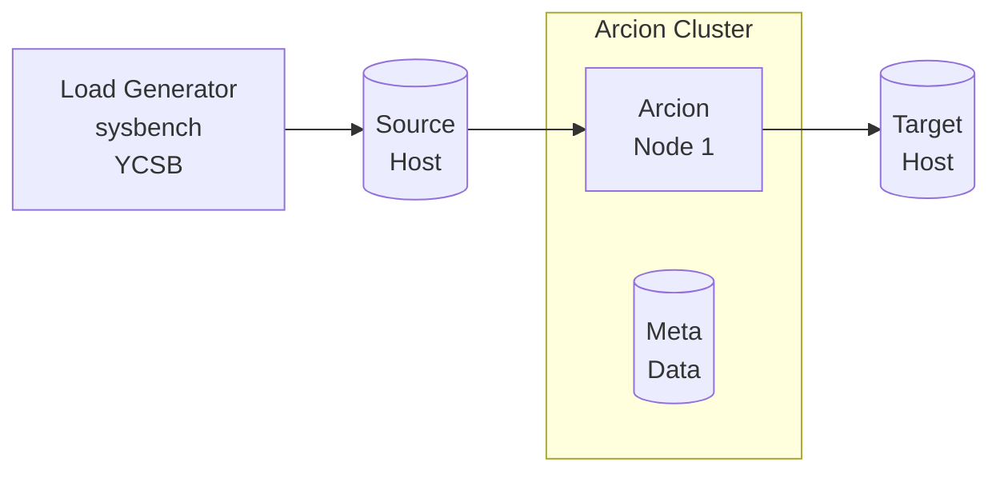

This is [Arcion](https://www.arcion.io/) Replicant demos using [CLI](https://docs.arcion.io/docs/quickstart/index.html) and [GUI](https://docs.arcion.io/docs/arcion-cloud-dashboard/quickstart/index.html).

# Overview
The diagram below depicts the components of the demo.
More details is available on the [demo kit](./docs/README.demo.md)

- Load Generator
- Source host
- Arcion host with dedicated metadata database
- Target host



# How to Run a Demo

The demo can be run with as follows:

```bash
./arcdemo.sh {arcion replication} {source} {destination}
```

Some simple examples demo runs:

```bash
./arcdemo.sh snapshot mysql mysql
./arcdemo.sh real-time mysql mariadb
./arcdemo.sh full postgresql broker
./arcdemo.sh delta-snapshot postgresql mongodb
```

-  Replication Type
Arcion has the following replication types.

    - `snapshot` does bulk export and import
    - `real-time` does CDC
    - `full` does `snapahot` + `realtime`
    - `delta-snapshot` does export at 10 sec intervals

- Source and Destinations
    - mysql, mariadb, singlestore
    - postgresql, yugabyte
    - oracle
    - sqlserver
    - sybase
    - mongodb
    - kafka on-prem, confluent cloud

# Demo Install Steps

Below instructions assume Linux, Mac and Linux and Windows WSL2.

## Get Arcion License

Make sure $ARCION_LICENSE is not blank and is valid

```bash
export ARCION_LICENSE="$(cat replicant.lic | base64)"
if [ -z "${ARCION_LICENSE}" ]; then echo "ERROR: ARCION_LICENSE is blank"; fi
echo "${ARCION_LICENSE}" | base64 -d
```

- Save Arcion License for reuse
```bash
if [ -f ~/.zshrc ]; then echo "export ARCION_LICENSE=\"${ARCION_LICENSE}\"" >> ~/.zshrc; fi
if [ -f ~/.bashrc ]; then echo "export ARCION_LICENSE=\"${ARCION_LICENSE}\"" >> ~/.bashrc; fi
```

## Create Docker network

```bash
docker network create arcnet
```

## Start Arcion UI

### Start the metadata for the UI

```bash
docker volume create arcion-metadata 

docker run -d \
    --name arcion-metadata \
    --network arcnet \
    -e POSTGRES_USER=root \
    -e POSTGRES_PASSWORD=Passw0rd \
    -v arcion-metadata:/var/lib/postgresql/data \
    -p :5432 \
    postgres:14-alpine

docker exec -i arcion-metadata psql -Uroot<<EOF
    CREATE USER arcion PASSWORD 'Passw0rd';
    CREATE DATABASE arcion WITH OWNER arcion;
    CREATE DATABASE io_replicate WITH OWNER arcion;
EOF
```

### Download Oracle JDBC for Oracle source and target
```bash
mkdir -p arcion-ui/data
mkdir -p arcion-ui/config
mkdir -p arcion-ui/libs
curl -o arcion-ui/libs/ojdbc8.jar  --location https://download.oracle.com/otn-pub/otn_software/jdbc/1815/ojdbc8.jar
```

### Start Arcion UI
```bash
docker run -d \
    --name arcion-ui \
    --network arcnet \
    -e ARCION_LICENSE="${ARCION_LICENSE}" \
    -e DB_HOST=arcion-metadata \
    -e DB_PORT=5432 \
    -e DB_DATABASE=arcion \
    -e DB_USERNAME=arcion \
    -e DB_PASSWORD=Passw0rd \
    -p 8080:8080 \
    -v `pwd`/arcion-ui/data:/data \
    -v `pwd`/arcion-ui/config:/config \
    -v `pwd`/arcion-ui/libs:/libs \
    arcionlabs/replicant-on-premises:latest
```

make sure there are no warnings about license
```
docker logs arcion-ui
```    

open the browser on [http://localhost:8080](http://localhost:8080) with user:`admin` password:`arcion`

## Arcion Load Generator

```bash
docker run -d --name arcion-demo \
    --network arcnet \
    -e ARCION_LICENSE="${ARCION_LICENSE}" \
    -e LANG=C.UTF-8 \
    -p 7681:7681 \
    robertslee/arcdemo
```    


# Other Sources and Destinations

## Docker Based

- [CockroachDB](./docs/cockroach.md)
- [Informix](./docs/informix.md)
- [Kafka on-prem](./docs/README.kafka.md)
- [MariaDB](./docs/README.maria.md)
- [MySQL](./docs/README.mysql.md)
- [MongoDB](./docs/README.mongodb.md)
- [SingleStore](./docs/README.singlestore.md)
- [SQL Server](./docs/README.sqlserver.md)
- [YugabyteSQL](./docs/README.yugabyte.md)

## Cloud Based

- [Kafka Confluent Cloud](./docs/README.kafka.md#kafka-cloud-confluent)

# Work In Progress

Below is not in the demo YET but supports by Arcion.

- [Minio](./docs/README.minio.md)
- [Oracle](./docs/README.oracle.md)
- [Redis](./docs/README.redis.md)


# Getting around the Demo Kit

## CLI Demo Instructions

The `arcdemo.sh` are entered on the top panel highlighted below.
Use mouse to click Tmux windows and panes.


[asciinema](https://asciinema.org/a/554683) of typing the below commands.

## Changing Scale and Performance

The demo kit is setup to use 1 CPU and generated 1 TPS by default.
Use the following to change the CPUs and TPS.

For exmaple:

```
# uses 1 CPU for snapshot extract, 2 CPU for apply
./arcdemo.sh -b 1:2 snapshot sqlserver broker/confluent

# generate 100 TPS of sysbench and YCSB
./arcdemo.sh -r 100 snapshot sqlserver broker/confluent
```

Full usage options and the default values:
```
./arcdemo.sh: arcdemo [snapshot|real-time|full|delta-snapshot] [src_hostname_uri] [dst_hostname]
  flags
    -g run using GUI=0
  params
    -b snapshot_thread_ratio=1:1
    -c cdc_thread_ratio=1:1
    -f cfg_dir=
    -m max_cpus=20
    -r workload_rate=1
    -t workload_threads=1
    -w workload_timer=600
    -s workload_size_factor=1
```


## View Conole, Cfg and Logs

- Console View after successful run

`[Ctrl + b]` then `0` for the demo console.


- `[Ctrl + b]` then `1` for the Arcion YAML files.

  Use [vi](https://manpages.ubuntu.com/manpages/xenial/man1/nvi.1.html) directory tree view to navigate.


- `[Ctrl + b]` then `2` for the Arcion trace and error files.

Use [vi](https://manpages.ubuntu.com/manpages/xenial/man1/nvi.1.html) directory tree view to navigate. 

