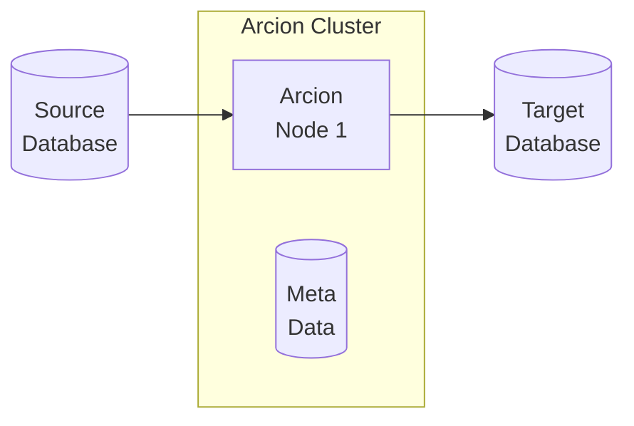

This is [Arcion](https://www.arcion.io/) Replicant demos using [CLI](https://docs.arcion.io/docs/quickstart/index.html) and [GUI](https://docs.arcion.io/docs/arcion-cloud-dashboard/quickstart/index.html).

# Overview
The diagram below depicts the components of the demo.


# CLI Demo Instructions

[asciinema](https://asciinema.org/a/554683) of typing the below commands.

Database sources with:
- Redo log such as MariaDB, MySQL, Postgres support Arcion's `snapshot`, `real-time`, `full`, and `delta-snapshot` replication modes.
- No Redo log access such as `CockroachDB`, `SingleStore`, `YugaByteSQL` support Arcion's `snapshot` and `delta-snapshot` replication modes.

Below instructions assume MacOS and Linux.  For the Windows users, use the single line version of the commands without the `\`

# Required

## Get Arcion License

Make sure $ARCION_LICENSE is not blank and is valid

```bash
export ARCION_LICENSE="$(cat replicant.lic | base64)"
if [ -z "${ARCION_LICENSE}" ]; then echo "ERROR: ARCION_LICENSE is blank"; fi
echo "${ARCION_LICENSE}" | base64 -d
```

- Save Arcion License for reuse
```bash
if [ -f ~/.zshrc ]; then echo "export ARCION_LICENSE=\"${ARCION_LICENSE}\"" >> ~/.zshrc; fi
if [ -f ~/.bashrc ]; then echo "export ARCION_LICENSE=\"${ARCION_LICENSE}\"" >> ~/.bashrc; fi
```

## Create Docker network

```bash
docker network create arcnet
```

## Postgres

Postgres will be used for:
- Arcion's UI
- Arcion replication metadata
- Arcion source and destination
```bash
# postgres with SSL setup
docker run -d \
    --name postgresql \
    --network arcnet \
    -e POSTGRES_PASSWORD=password \
    -p :5432 \
    postgres \
    -c wal_level=logical \
    -c max_replication_slots=10 \
    -c ssl=on \
    -c max_connections=300 \
    -c shared_buffers=80MB \
    -c ssl_cert_file=/etc/ssl/certs/ssl-cert-snakeoil.pem \
    -c ssl_key_file=/etc/ssl/private/ssl-cert-snakeoil.key    

# wait for db to come up
while [ -z "$( docker logs postgresql 2>&1 | grep 'database system is ready to accept connections' )" ]; do sleep 10; done;

# install wal2json for cdc
docker exec -it postgresql sh -c "apt update && apt install -y postgresql-15-wal2json postgresql-contrib"

# setup for Acrion UI and metadata
docker exec -i postgresql psql -Upostgres<<EOF
CREATE USER arcion PASSWORD 'password';
CREATE DATABASE arcion WITH OWNER arcion;
CREATE DATABASE io_replicate WITH OWNER arcion;
EOF
```
## Arcion Load Generator

```bash
docker run -d --name arcion-demo \
    --network arcnet \
    -e ARCION_LICENSE="${ARCION_LICENSE}" \
    -p 7681:7681 \
    robertslee/sybench
```    

# Optional for demos

## Arcion UI
```bash
docker run -d --name arcion-ui \
    --network arcnet \
    -e ARCION_LICENSE="${ARCION_LICENSE}" \
    -e DB_HOST=postgresql \
    -e DB_PORT=5432 \
    -e DB_DATABASE=arcion \
    -e DB_USERNAME=arcion \
    -e DB_PASSWORD=password \
    -p 8080:8080 \
    arcionlabs/replicant-on-premises:latest-arm64

# make sure there are no warnings about license
docker logs arcion-ui
```    

## MySQL

```bash
docker run -d \
    --name mysql \
    --network arcnet \
    -e MYSQL_ROOT_PASSWORD=password \
    -p :3306 \
    mysql \
    mysqld --default-authentication-plugin=mysql_native_password \
    --local-infile=true

# wait for db to come up
while [ -z "$( docker logs mysql 2>&1 | grep 'ready for connections' )" ]; do sleep 10; done;    
```    

## MariaDB

```bash
docker run -d \
    --name mariadb \
    --network arcnet \
    -e MYSQL_ROOT_PASSWORD=password \
    -p :3306 \
    mariadb \
    mysqld --default-authentication-plugin=mysql_native_password \
    --log-bin=mysql-log.bin \
    --binlog-format=ROW
```

## SingleStore
```bash
docker run -d --net arcnet --name singlestore -i --init \
    -e LICENSE_KEY="$SINGLESTORE_LICENSE" \
    -e ROOT_PASSWORD="password" \
    -e START_AFTER_INIT=Y \
    -p :3306 -p :8080 \
    singlestore/cluster-in-a-box
```

## CockroachDB
```
docker volume create roach1
docker volume create roach2
docker volume create roach3

docker run -d \
--name=cockroach-1 \
--hostname=cockroach-1 \
--net=arcnet \
-p :26257 -p :8080  \
-v "roach1:/cockroach/cockroach-data"  \
cockroachdb/cockroach:v22.2.3 start \
--insecure \
--join=cockroach-1,cockroach-2,cockroach-3

docker run -d \
--name=cockroach-2 \
--hostname=cockroach-2 \
--net=arcnet \
-p :26257 -p :8080  \
-v "roach2:/cockroach/cockroach-data" \
cockroachdb/cockroach:v22.2.3 start \
--insecure \
--join=cockroach-1,cockroach-2,cockroach-3

docker run -d \
--name=cockroach-3 \
--hostname=cockroach-3 \
--net=arcnet \
-p :26257 -p :8080  \
-v "roach3:/cockroach/cockroach-data" \
cockroachdb/cockroach:v22.2.3 start \
--insecure \
--join=cockroach-1,cockroach-2,cockroach-3

docker exec -it cockroach-1 ./cockroach init --insecure
```   
# Work In Progress

Below is not in the demo YET but supports by the product.

## YugaByte
NOTE: This will run 
```bash
docker run -d --name yugabytesql \
    --network arcnet \
    -p7001:7001 -p9000:9000 -p5433:5433 -p9042:9042 \
    yugabytedb/yugabyte bin/yugabyted start\
    --daemon=false
```

# Running the CLI demo

Open a browser with tabs for [Arcion CLI](http://localhost:7681)

[tmux](https://man7.org/linux/man-pages/man1/tmux.1.html) is used in this console. Useful `tmux` commands are:

 
In the console windows, type the following for fully automated mode.


- run mysql source and target with Arcion snapshot mode
```bash
SRCDB_HOST=mysql DSTDB_HOST=mysql REPL_TYPE=snapshot ./menu.sh
```
- run mysql source and target with Arcion real-time mode
```bash
SRCDB_HOST=mysql DSTDB_HOST=mysql REPL_TYPE=real-time ./menu.sh
```
- run mysql source and target with Arcion real-time mode
```bash
SRCDB_HOST=mysql DSTDB_HOST=mysql REPL_TYPE=delta-snapshot ./menu.sh
```
- run mysql source and target with Arcion full mode
```bash
SRCDB_HOST=mysql DSTDB_HOST=mysql REPL_TYPE=full ./menu.sh
```
  NOTE: This mode does not stop.  type `pkill java` to stop the process.

- run in interactive mode where system asks for source and target
```bash
unset SRCDB_HOST SRCDB_TYPE DSTDB_HOST DSTDB_TYPE REPL_TYPE; ./menu.sh
```
# view Conole, Cfg and Logs

- To Stop the Run

1. press `[Ctrl + b]`, then `3` 
2. type `pkill java`
3. press `[Ctrl + b]`, then `0` 

- Console View after successful run

`[Ctrl + b]` then `0` for the Arcion YAML files.


- `[Ctrl + b]` then `1` for the Arcion YAML files.

Use [vi](https://manpages.ubuntu.com/manpages/xenial/man1/nvi.1.html) directory tree view to navigate.


- `[Ctrl + b]` then `2` for the Arcion trace and error files.

Use [vi](https://manpages.ubuntu.com/manpages/xenial/man1/nvi.1.html) directory tree view to navigate. 

