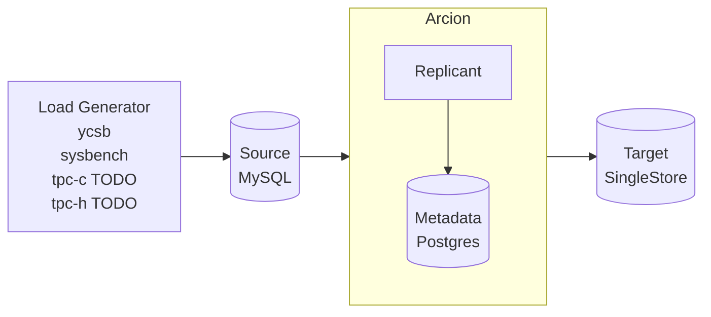
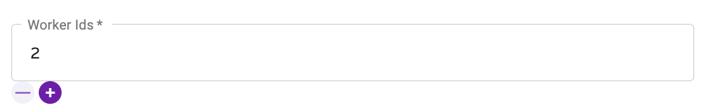

This is [Arcion](https://www.arcion.io/) Replicant demos using [CLI](https://docs.arcion.io/docs/quickstart/index.html) and [GUI](https://docs.arcion.io/docs/arcion-cloud-dashboard/quickstart/index.html).
Use GUI for out of the box demos.
Use CLI for testing what if scenarions.
GUI is preconfigured with preset source and target data combinations.
CLI supports all source target data combinations.

# Overview
The diagram below depicts the components of the demo.


## Arcion GUI 
Arcion GUI running Arcion [snapshot](https://docs.arcion.io/docs/running-replicant/#replicant-snapshot-mode) and [full](https://docs.arcion.io/docs/running-replicant/#replicant-full-mode) replication modes are shown in the below animation.

**Note**: GUI demo supports Docker running on an `amd64` platform. So no Apple M1/M2 for now.


# GUI Demo Instructions

Instructions for setting up licenses for Arcion and SingleStore are [below](#prerequisite).

- Start the demo below
- point browser to [Arcion GUI](http://localhost:8080) 
- point browser to [load generator UI](http://localhost:7681).  

```
# download demo repo
git clone https://github.com/robert-s-lee/arcion-demo
cd arcion-demo

# setup the licenses before starting the demo
export ARCION_LICENSE=$(cat replicant.lic | base64)

# start containers
docker compose -f acrion-mysql-s2-compose.yaml up
```

# CLI Demo Instructions

- run MySQL source and MySQL Target
```
git clone https://github.com/robert-s-lee/arcion-demo
cd arcion-demo

# setup the licenses before starting the demo
export ARCION_LICENSE=$(cat replicant.lic | base64)

# start containers
act -W .github/workflows/cli.yaml --input COMPOSE_FILE=compose/climymy/climymy.yaml
act -W .github/workflows/cli.yaml --input COMPOSE_FILE=compose/climys2/climys2.yaml
act -W .github/workflows/cli.yaml --input COMPOSE_FILE=compose/climypg/climypg.yaml
```

- select full or snapshot

and select source and target

my=mysql
pg=postgres
s2=singlestore

mymy = mysql to mysql
mypg = mysql to postgres

```
/jobs/full.sh
/jobs/snapshot.sh
```

# Prerequisite

This is a step by step instructions that uses:

- [Arcion Replicant w/GUI](https://docs.arcion.io/docs/arcion-cloud-dashboard/quickstart/index.html) 
- [sysbench](https://github.com/akopytov/sysbench) for generating OLTP workload on the source database 
- [ycsb](https://github.com/brianfrankcooper/YCSB) for generating massive load on the source database 
- [MySQL](https://www.mysql.com/) for the source database
- [Postgres](https://www.postgresql.org/) for Arcion's metastore
- [SingleStore](https://www.singlestore.com/) the target database


- Docker

Install [Docker Desktop](https://docs.docker.com/desktop/)

- Brew

- Arcion Trial License

Obtain [Arcion demo license](https://www.arcion.io/#) and save as licenses/arcion/arcion.lic.  The license would look like this

```
cat $ARCION_LIC_DIR/replicant.lic
{
  "license" : {
    "uuid" : "xxxxxxxxxxxxxxxx",
    "owner" : "Arcion-28122022",
    "created" : "2022-12-28T00:00Z",
    "expires" : "2023-01-27T00:00Z",
    "type" : "ONLINE",
    "edition" : "ENTERPRISE",
    "src" : [ "ALL" ],
    "dst" : [ "ALL" ]
  },
  "key" : "xxxxxxxxxxxxxxxxxxxxxxxxxxxxxxxxxxxxxxxxxxxxxxxx"
}
```

- prepare volume 

  - for GUI

```
docker volume create arionc_lic
docker run --rm -v arcion_lic:/config -e ARCION_LICENSE=$ARCION_LICENSE alpine sh -c 'echo $ARCION_LICENSE | base64 --decode > /config/replicant.lic'
docker run --rm -v arcion_lic:/config arcion cat /config/replicant.lic
```

  - for CLI

  audomated via github action


- SingleStore Trial License

Obtain [Singlestore Standard trial license](https://www.singlestore.com/self-managed-standard/)

```
export SINGLE_STORE_LIC="xxxxxxxxxxxxxxxx"
```

- verify the following are set
```
echo $ARCION_LIC_DIR
echo $SINGLE_STORE_LIC
```

# Running the demo

- Open a browser with tabs for [Arcion](http://localhost:8080) and [tumx](http://localhost:7681)


- In the `Arcion` tab, follow the [Arcion Cloud Tutorial](https://docs.arcion.io/docs/arcion-cloud-dashboard/quickstart/index.html)
- In the `tmux` tab, type the following commands for `sysbench` and `ycsb` workloads respectively.  Useful `tmux` commands are:

  Ctrl + b + % to split the current pane vertically.

  Ctrl + b + " to split the current pane horizontally.

  Ctrl + b + x to close the current pane.

  Ctrl + b + `<up arrow>` to move up the pane.

  Ctrl + b + `<down arrow>` to move down the pane.

  Ctrl + s to connect to a different session.
  

  Below are the commands on each of the panes assuming `Ctl + b + "` was used three times to create three panes.

```
/scripts/sysbench.sh
/scripts/ycbs.sh
dstat
```

- Monitor the `sysbench`

  In the `tmux` tab, run the following to verify that count and sum match when the load is done. the sum may not match while the load is still running.  

```
mysql -hmysql1 -usbt -ppassword -Dsbt -e 'select count(*) from sbtest1; select sum(k) from sbtest1;'

mysql -hsinglestore -uroot -ppassword  -Dsbt -e 'select count(*) from sbtest1; select sum(k) from sbtest1;'
```

# Test coverage

| Workload | Replication Mode | Write Mode | source | target | 
| -- | -- | -- | -- | -- |
| sysbench | snapshot | Replacing | mysql | singlesstore 
| sysbench | full | Replacing | mysql | singlesstore

# Common issues

## apple silicon

not fully supported now.  start wait for arcion to be healty before starting the UI.  If unhealthy, then kill, cleanup and restart.

```
docker ps --all

dd592edb0552   robertslee/arcion:latest        "python3 bootstrap.py"   About a minute ago   Up About a minute (health: starting)   0.0.0.0:8080->8080/tcp                                     arcion

dd592edb0552   robertslee/arcion:latest        "python3 bootstrap.py"   2 minutes ago       Up 2 minutes (unhealthy)   0.0.0.0:8080->8080/tcp                                     arcion
```

healty state 
```
179d6bdc25dc   robertslee/arcion:latest        "python3 bootstrap.py"   About a minute ago   Up About a minute (healthy)   0.0.0.0:8080->8080/tcp                                     arcion
```

clean up and restart
```
control - c
docker-compose -f acrion-mysql-s2-compose.yaml down
docker volume prune
```

## license 

- license file not present
- license file not valid
- license expired

## replication topology 

- can not change from snap to full.  will stay in full
- can have 2nd snapshot to the same source
- cannot have 2nd full to the same source 
  
- `Worker Ids` needs to be unique when multiple connections to the same source are configure.  Otherwise, below message will be in the error pane.



```
02:53:48.507 [pool-31-thread-1] [replicant] ERROR t.r.db.jdbc.mysql.MySQLCDCExtractor - binlogger error message: ERROR: Got error reading packet from server: A slave with the same server_uuid/server_id as this slave has connected to the master; the first event 'binlog.000002' at 119263798, the last event read from './binlog.000002' at 126, the last byte read from './binlog.000002' at 119263798.
```