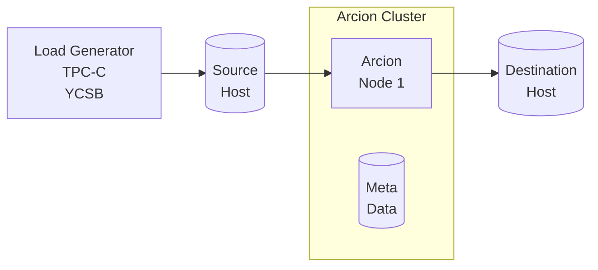

Please use [Arcion demo kit docs](https://arcionlabs.github.io/demokit-docs.gtihub-io/).   

Below docs is deprecated and will be removed soon.

# Overview

This is [Arcion](https://www.arcion.io/) Replicant demos using [CLI](https://docs.arcion.io/docs/quickstart/index.html) and [GUI](https://docs.arcion.io/docs/arcion-cloud-dashboard/quickstart/index.html).  The demo environment is fully dockerized.  The demo environment is meant to provide local environment for learning and functional testing of Arcion product.  The demo is not intended for performance and scalability comparisons.  Please review Arcion [Docs](https://docs.arcion.io/) for each source and destination for reference information.

The diagram below depicts the components of the demo.  Each component runs in a separate docker container.  Setup required to generate data, run the workload load, setup the source and destination databases are a part of the demo kit.

- Load Generator
- Source database
- Arcion host with dedicated metadata database
- Destination database

