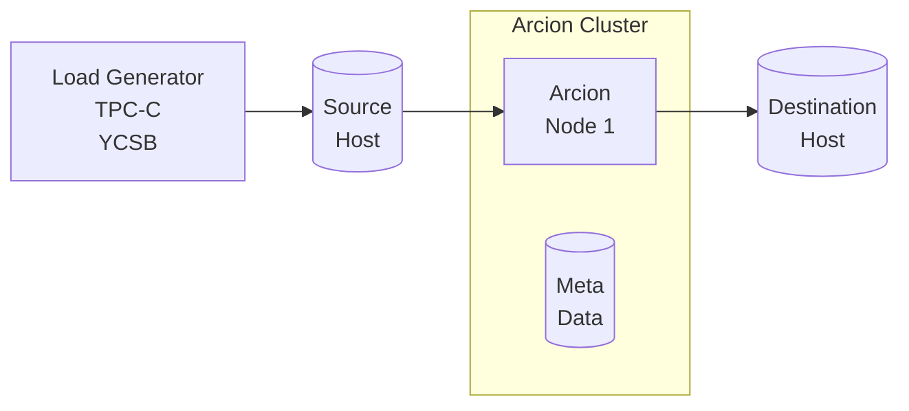

This is [Arcion](https://www.arcion.io/) Replicant demos using [CLI](https://docs.arcion.io/docs/quickstart/index.html) and [GUI](https://docs.arcion.io/docs/arcion-cloud-dashboard/quickstart/index.html).  The demo environment is fully dockerized.  The demo environment is meant to provide local environment for learning and functional testing of Arcion product.  The demo is not intended for performance and scalability comparisons.  Please review Arcion [Docs](https://docs.arcion.io/) for each source and destination for reference information.

# Overview
The diagram below depicts the components of the demo.  Each component runs in a separate docker container.  Setup required to generate data, run the workload load, setup the source and destination databases are a part of the demo kit.

- Load Generator
- Source database
- Arcion host with dedicated metadata database
- Destination database



# How to Run a Demo

The demo can be run with as follows:

```bash
./arcdemo.sh {replication mode} {source hostname} {destination hostname}
```

Some examples Arcion Demo Load Generator CLI commands on [http://localhost:7681](http://localhost:7681):

```bash
./arcdemo.sh snapshot mysql mysql
./arcdemo.sh real-time oraee postgresql
./arcdemo.sh full postgresql broker
./arcdemo.sh delta-snapshot mysql mongodb
```

-  Replication Type
Arcion has the following replication types.

    - `snapshot` does bulk export and import
    - `real-time` does CDC
    - `full` does `snapahot` + `realtime`
    - `delta-snapshot` does export at 10 sec intervals

- Source and Destinations
    - mysql, mariadb, singlestore
    - cockroach, postgresql, yugabyte
    - oracle
    - sqlserver
    - sybase
    - mongodb
    - opensource kafka, confluent platform, confluent cloud

# Step 1: Arcion Demo Load Generate and UI Setup

Below instructions assume Linux, Mac and Linux and Windows WSL2.
- Docker should be setup and running.
- The Docker should be given at least 4 CPUs, 8 GB of RAM.  
- Some database may require more CPU and RAM.
- Assume `bash` proficiency for cut/pasting the commands below.

The following this the user name and password convention:
- The common password of `Passw0rd` is used.  
- `arcsrc` is the default base source database user name.
- `arcdst` is the default base destination database user name.

workload of various size is separated by using the workload scale factor to suffix the user name.  For example, the default workload scale factor 1 uses `arcsrc1` and `arcdst1` as the source and destination user names.  A workload scale factor 10 would use `arcsrc10` and `arcdst10`.  

## Get Arcion License

Request a Arcion demo license.  The `replicant.lic` file needs to be converted to `base64` format with the instructions below.  Make sure the resulting `$ARCION_LICENSE` is not blank and is the date has not expired.

```bash
export ARCION_LICENSE="$(cat replicant.lic | base64)"
if [ -z "${ARCION_LICENSE}" ]; then echo "ERROR: ARCION_LICENSE is blank"; fi
echo "${ARCION_LICENSE}" | base64 -d
```

Save the License for reuse
```bash
if [ -f ~/.zshrc ]; then echo "export ARCION_LICENSE=\"${ARCION_LICENSE}\"" >> ~/.zshrc; fi
if [ -f ~/.bashrc ]; then echo "export ARCION_LICENSE=\"${ARCION_LICENSE}\"" >> ~/.bashrc; fi
```

## Create Docker network

Create Arcion network.  The containers will be placed this network in order to communicate with each another.

```bash
docker network create arcnet
```

## Start the metadata for Arcion CLI and UI

This follows the instructions from [here](https://hub.docker.com/r/arcionlabs/replicant-on-premises).

```bash
docker volume create arcion-metadata 

docker run -d \
    --name arcion-metadata \
    --network arcnet \
    -e POSTGRES_USER=root \
    -e POSTGRES_PASSWORD=Passw0rd \
    -v arcion-metadata:/var/lib/postgresql/data \
    -p :5432 \
    postgres:14-alpine

docker exec -i arcion-metadata psql -Uroot<<EOF
    CREATE USER arcion PASSWORD 'Passw0rd';
    CREATE DATABASE arcion WITH OWNER arcion;
    CREATE DATABASE io_replicate WITH OWNER arcion;
EOF
```

### Download Oracle JDBC to use with Oracle source and destination

This follows instructions from [here](https://docs.arcion.io/docs/source-setup/oracle/setup-guide/oracle-traditional-database/#i-obtain-the-jdbc-driver-for-oracle)

```bash
mkdir -p arcion-ui/data
mkdir -p arcion-ui/config
mkdir -p arcion-ui/libs
curl -o arcion-ui/libs/ojdbc8.jar --location https://download.oracle.com/otn-pub/otn_software/jdbc/1815/ojdbc8.jar
```

## Start Arcion UI

This follows the instructions from [here](https://hub.docker.com/r/arcionlabs/replicant-on-premises).

```bash
docker run -d \
    --name arcion-ui \
    --network arcnet \
    -e ARCION_LICENSE="${ARCION_LICENSE}" \
    -e DB_HOST=arcion-metadata \
    -e DB_PORT=5432 \
    -e DB_DATABASE=arcion \
    -e DB_USERNAME=arcion \
    -e DB_PASSWORD=Passw0rd \
    -p 8080:8080 \
    -v `pwd`/arcion-ui/data:/data \
    -v `pwd`/arcion-ui/config:/config \
    -v `pwd`/arcion-ui/libs:/libs \
    arcionlabs/replicant-on-premises:latest
```

Make sure there are no warnings about license.
Give about a minute to Arcion UI to initialize the metadata.  
Noting in the log is success.

```
docker logs arcion-ui
```    

open browser on [http://localhost:8080](http://localhost:8080) with user:`admin` password:`arcion`.  

## Arcion Demo Load Generator

Arcion Demo Load Generator CLI is accessibel on [http://localhost:7681](http://localhost:7681). 

```bash
docker run -d --name arcion-demo \
    --network arcnet \
    -e ARCION_LICENSE="${ARCION_LICENSE}" \
    -e LANG=C.UTF-8 \
    -p 7681:7681 \
    robertslee/arcdemo
```    

# Step 2: Set up Sources and Destinations databases

## Docker Based

The following databases are more common.

- [MySQL](./docs/mysql/README.md)
- [Oracle](./docs/oracle/README.md)
- [SQL Server](./docs/README.sqlserver.md)
- [Informix](./docs/informix.md)
- [Postgresql](./docs/README.postgresql.md)

The following are commonly used for destination databases.  Some are distributed databases that will take more CPU and RAM for setup.

- [CockroachDB](./docs/cockroach.md)
- [Kafka on-prem](./docs/README.kafka.md)
- [MariaDB](./docs/README.maria.md)
- [MongoDB](./docs/README.mongodb.md)
- [SingleStore](./docs/README.singlestore.md)
- [YugabyteSQL](./docs/README.yugabyte.md)

## Cloud Based

- [Kafka Confluent Cloud](./docs/README.kafka.md#kafka-cloud-confluent)

## Work In Progress

Below is not in the demo YET but supports by Arcion.

- [Minio](./docs/README.minio.md)
- [Redis](./docs/README.redis.md)


# Step 3: Getting around the Arcion Demo Load Generator

## CLI Demo Instructions

The `arcdemo.sh` are entered on the top panel highlighted below.
Use mouse to click Tmux windows and panes.


[asciinema](https://asciinema.org/a/554683) of typing the below commands.

## Changing Scale and Performance

The demo kit is setup to use 1 CPU and generated 1 TPS by default.
Use the following to change the CPUs and TPS.

For example:

```
# uses 1 CPU for snapshot extract, 2 CPU for apply
./arcdemo.sh -b 1:2 snapshot sqlserver broker/confluent

# generate 100 TPS of sysbench and YCSB
./arcdemo.sh -r 100 snapshot sqlserver broker/confluent
```

Full usage options and the default values:
```
./arcdemo.sh: arcdemo [snapshot|real-time|full|delta-snapshot] [src_hostname_uri] [dst_hostname]
  flags
    -g run using GUI=0
  params
    -b snapshot_thread_ratio=1:1
    -c cdc_thread_ratio=1:1
    -f cfg_dir=
    -m max_cpus=20
    -r workload_rate=1
    -t workload_threads=1
    -w workload_timer=600
    -s workload_size_factor=1
```


## View Conole, Cfg and Logs

- Console View after successful run

`[Ctrl + b]` then `0` for the demo console.


- `[Ctrl + b]` then `1` for the Arcion YAML files.

  Use [vi](https://manpages.ubuntu.com/manpages/xenial/man1/nvi.1.html) directory tree view to navigate.


- `[Ctrl + b]` then `2` for the Arcion trace and error files.

Use [vi](https://manpages.ubuntu.com/manpages/xenial/man1/nvi.1.html) directory tree view to navigate. 

