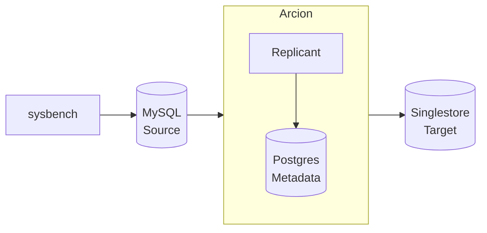

Demo of Arcion Replicant Bulk and Realtime replication.  The realtime replication runs Insert, Update and Delete from a source to target database.  

This step by step instructions uses:

- Docker containers
- sysbench is used for load generator to the source database 
- MySQL is used for the source database
- Arcion Replicant is used to replicate from the source to target database
- Postgres is used for Arcion's metastore enabling HA
- SingleStore is used for the target database

The diagram below depicts the data flow:


# Demo Licenses

- Obtain Arcion demo license

the license would look like this
```
mkdir -p licenses/arcion
cat licenses/arcion.lic
{
  "license" : {
    "uuid" : "xxxxxxxxxxxxxxxx",
    "owner" : "Arcion-28122022",
    "created" : "2022-12-28T00:00Z",
    "expires" : "2023-01-27T00:00Z",
    "type" : "ONLINE",
    "edition" : "ENTERPRISE",
    "src" : [ "ALL" ],
    "dst" : [ "ALL" ]
  },
  "key" : "xxxxxxxxxxxxxxxxxxxxxxxxxxxxxxxxxxxxxxxxxxxxxxxx"
}
```

- Obtain Singlestore demo license

```
mkdir -p licenses/singlestore
cat licenses/singlestore/singlestore.lic
export SINGLE_STORE_LICENSE_KEY="xxxxxxxxxxxxxxxx"
```

# Docker configurations

- pull the images
```bash
docker pull arcionlabs/replicant-on-premises
docker pull mysql
docker pull postgres
docker pull singlestore/cluster-in-a-box
docker pull robertslee/ycsb # TODO
```

- create a network  
```bash
docker network create arcnet
```

- create volumes  
 
```bash
docker volume create mysql1
docker volume create singlestore
docker volume create arcion_lic
docker volume create arcion1
docker volume create arcion_pg
```

# setup Trial Licenses

- add Arcion license into volume

Using base64 so that license file can be passed as a secret

```
export ARCION_LIC=$(cat licenses/arcion/replicant.lic | base64)
docker run --rm -v arcion_lic:/config -e ARCION_LIC=$ARCION_LIC ubuntu sh -c 'echo $ARCION_LIC | base64 --decode > /config/replicant.lic'

docker run --rm -v arcion_lic:/config ubuntu cat /config/replicant.lic
```

old way of doing this
```
docker run --rm -v `pwd`/licenses/arcion:/arcion -v arcion_lic:/config ubuntu cp /arcion/replicant.lic /config/.
```

- [SingleStore]

TODO

# Start the containers

- start mysql source

```bash
docker run --net mynet --name mysql1 -p 33061:3306 -e MYSQL_ROOT_PASSWORD=password -d --restart unless-stopped -v mysql1:/var/lib/mysql  mysql:latest
```

- start postgres for arcion
```bash
docker run --net mynet --name arcion_pg -p 54320:5432 -e POSTGRES_PASSWORD=password -d --restart unless-stopped -v arcion_pg:/var/lib/postgresql/data  postgres
```

- start arcion
```
docker run --net mynet --name arcion1 -p 8080:8080 -e DB_HOST=arcion_pg -e DB_USERNAME=postgres -e DB_PASSWORD=password -e DB_DATABASE=postgres -d --restart unless-stopped -v arcion_lic:/config -v arcion1:/data arcionlabs/replicant-on-premises:latest
```

- start singlestore (memsql)

```
docker run --net mynet --name singlestore -i --init \
    -e LICENSE_KEY=$SINGLE_STORE_LICENSE_KEY \
    -e ROOT_PASSWORD="password" \
    -p 3306:3306 -p 8081:8080 \
    singlestore/cluster-in-a-box

docker start singlestore
```

# Provision  

- setup mysql accounts for ycsb and sysbench
```bash
cat scripts/mysql.init.sql | docker exec -i mysql1 mysql -hmysql1 -uroot -ppassword --verbose < 
```

# start the sysbench

- setup alias to simplify typing
```
d(){docker run --net mynet --rm -it ycsb "$@"}
```

- populate the data
```
d sysbench oltp_read_write --mysql-host=mysql1 --auto_inc=off --db-driver=mysql --mysql-user=sbt --mysql-password=password --mysql-db=sbt prepare 
```
- start the insert, update, delete
```
d sysbench oltp_read_write --mysql-host=mysql1 --auto_inc=off --db-driver=mysql --mysql-user=sbt --mysql-password=password --mysql-db=sbt --report-interval=1 --time=360 --threads=4 run                                                                  
```

# monitor databases

- the count and sum should match when the load is done. the sum should not match while the load is still running
```
d mysql -hmysql1 -usbt -ppassword -Dsbt -e 'select count(*) from sbtest1; select sum(k) from sbtest1;'
d mysql -hsinglestore -uroot -ppassword  -Dsbt -e 'select count(*) from sbtest1; select sum(k) from sbtest1;'
```

http://localhost:8080
http://localhost:8081

# monitor sysbench

- thds: 4 = 4 threads
- tps: 240.99 = 240 transaction where each txn consists of 
- qps: 4827.70 (r/w/o: 3374.79/970.94/481.97) 

```
[ 360s ] thds: 4 tps: 240.99 qps: 4827.70 (r/w/o: 3374.79/970.94/481.97) lat (ms,95%): 21.50 err/s: 0.00 reconn/s: 0.00
```
