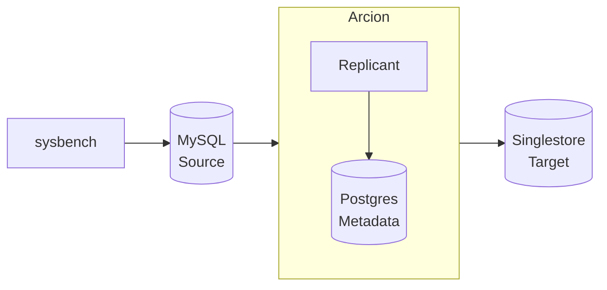

Demo of Arcion Replicant Bulk and Realtime replication.  The realtime replication runs Insert, Update and Delete from a source to target database.  

This step by step instructions uses:

- Docker containers
- sysbench is used for load generator to the source database 
- MySQL is used for the source database
- Arcion Replicant is used to replicate from the source to target database
- Postgres is used for Arcion's metastore enabling HA
- SingleStore is used for the target database

The diagram below depicts the data flow:


# Demo Licenses

- Obtain [Arcion demo license](https://www.arcion.io/#)

the license would look like this
```
export ARCION_LICENSE=$(cat licenses/arcion/replicant.lic | base64)

mkdir -p licenses/arcion
cat licenses/arcion.lic
{
  "license" : {
    "uuid" : "xxxxxxxxxxxxxxxx",
    "owner" : "Arcion-28122022",
    "created" : "2022-12-28T00:00Z",
    "expires" : "2023-01-27T00:00Z",
    "type" : "ONLINE",
    "edition" : "ENTERPRISE",
    "src" : [ "ALL" ],
    "dst" : [ "ALL" ]
  },
  "key" : "xxxxxxxxxxxxxxxxxxxxxxxxxxxxxxxxxxxxxxxxxxxxxxxx"
}
```

- Obtain [Singlestore Standard trial license](https://www.singlestore.com/self-managed-standard/)

```
source licenses/singlestore/singlestore.lic

mkdir -p licenses/singlestore
cat licenses/singlestore/singlestore.lic
export SINGLE_STORE_LIC="xxxxxxxxxxxxxxxx"
```

```
echo $ARCION_LICENSE
echo $SINGLE_STORE_LIC
```
# Docker configurations

- pull the images

[arcion](https://hub.docker.com/r/arcionlabs/replicant-on-premises/tags)

TODO: qualify the tag names used
```
export ARCION_TAG=latest
export MYSQL_TAG=latest
export POSTGRES_TAG=latest
export SYBENCH_TAG=latest
export SINGLESTORE_TAG=latest
```

```bash
docker pull arcionlabs/replicant-on-premises:$ARCION_TAG
docker pull mysql:$MYSQL_TAG
docker pull postgres:$POSTGRES_TAG
docker pull singlestore/cluster-in-a-box:$SINGLESTORE_TAG
docker pull robertslee/sybench:$SYBENCH_TAG
```


- create a network  
```bash
docker network create arcnet
```

- create volumes  
 
```bash
docker volume create mysql1
docker volume create singlestore
docker volume create arcion_lic
docker volume create arcion1
docker volume create arcion_pg
```

# setup Trial Licenses

- add Arcion license into volume

Using base64 so that license file can be passed as a secret

```
docker run --rm -v arcion_lic:/config -e ARCION_LICENSE=$ARCION_LICENSE ubuntu sh -c 'echo $ARCION_LICENSE | base64 --decode > /config/replicant.lic'

docker run --rm -v arcion_lic:/config ubuntu cat /config/replicant.lic
```

# Start the containers

- start mysql source

```bash
docker run --net arcnet --name mysql1 -p 33061:3306 -e MYSQL_ROOT_PASSWORD=password -d --restart unless-stopped -v mysql1:/var/lib/mysql  mysql:$MYSQL_TAG
```

- start postgres for arcion
```bash
docker run --net arcnet --name arcion_pg -p 54320:5432 -e POSTGRES_PASSWORD=password -d --restart unless-stopped -v arcion_pg:/var/lib/postgresql/data  postgres:$POSTGRES_TAG
```

- start arcion

access arcion ui with id:password of `admin:arcion` on [http://localhost:8080](http://localhost:8080)
```
docker run --net arcnet --name arcion1 -p 8080:8080 -e DB_HOST=arcion_pg -e DB_USERNAME=postgres -e DB_PASSWORD=password -e DB_DATABASE=postgres -d --restart unless-stopped -v arcion_lic:/config -v arcion1:/data arcionlabs/replicant-on-premises:$ARCION_TAG
```

- start singlestore (memsql)

access singlestore ui with id:password of `root:password` on [http://localhost:8081](http://localhost:8081)

```
docker run --net arcnet --name singlestore -i --init \
    -e LICENSE_KEY=$SINGLE_STORE_LIC \
    -e ROOT_PASSWORD="password" \
    -p 3306:3306 -p 8081:8080 \
    singlestore/cluster-in-a-box:$SINGLESTORE_TAG

docker start singlestore
```

# Provision  

- setup mysql accounts for ycsb and sysbench
```bash
cat scripts/mysql.init.arcion.sql | docker exec -i mysql1 mysql -hmysql1 -uroot -ppassword --verbose
cat scripts/mysql.init.sysbench.sql | docker exec -i mysql1 mysql -hmysql1 -uroot -ppassword --verbose
cat scripts/mysql.init.ycsb.sql | docker exec -i mysql1 mysql -hmysql1 -uroot -ppassword --verbose
```

# start the sysbench

- setup function named `d` to simplify typing
```
d() {docker run --net arcnet --rm -it robertslee/sybench:${SYBENCH_TAG:-latest} "$@"}
```

- populate the data
```
d sysbench oltp_read_write --mysql-host=mysql1 --auto_inc=off --db-driver=mysql --mysql-user=sbt --mysql-password=password --mysql-db=sbt prepare 

d mysql -hmysql1 -usbt -ppassword -Dsbt --verbose -e 'select count(*) from sbtest1; select sum(k) from sbtest1;desc sbtest1;select * from sbtest1 limit 5'
```

- setup arcion replication

Follow the [Arcion Cloud Tutorial](https://docs.arcion.io/docs/arcion-cloud-dashboard/quickstart/index.html)


- start the insert, update, delete
```
d sysbench oltp_read_write --mysql-host=mysql1 --auto_inc=off --db-driver=mysql --mysql-user=sbt --mysql-password=password --mysql-db=sbt --report-interval=1 --time=60 --threads=1 run                                                                  
```

# start ycsb

- load data
```
d mysql -u ycsb -D ycsb -ppassword -hmysql1 -e "truncate usertable" 

d bin/ycsb.sh load jdbc -s -P workloads/workloada -p db.driver=com.mysql.jdbc.Driver -p db.url="jdbc:mysql://mysql1/ycsb?rewriteBatchedStatements=true" -p db.user=ycsb -p db.passwd="password" -p db.batchsize=1000  -p jdbc.fetchsize=10 -p jdbc.autocommit=true -p jdbc.batchupdateapi=true -p db.batchsize=1000 -p recordcount=100000

d mysql -hmysql1 -uycsb -ppassword -Dycsb --verbose -e 'select count(*) from usertable; desc usertable;select * from usertable limit 5'
```

```
d bin/ycsb.sh run jdbc -s -P workloads/workloada -p db.driver=com.mysql.jdbc.Driver -p db.url="jdbc:mysql://mysql1/ycsb" -p db.user=ycsb -p db.passwd="password" -p db.batchsize=1000  -p jdbc.fetchsize=10 -p jdbc.autocommit=true -p db.batchsize=1000 -p recordcount=100000 -p operationcount=10000
```

# monitor databases

- the count and sum should match when the load is done. the sum should not match while the load is still running
```
d mysql -hmysql1 -usbt -ppassword -Dsbt -e 'select count(*) from sbtest1; select sum(k) from sbtest1;'
d mysql -hsinglestore -uroot -ppassword  -Dsbt -e 'select count(*) from sbtest1; select sum(k) from sbtest1;'
```

http://localhost:8080
http://localhost:8081

# monitor sysbench

- thds: 4 = 4 threads
- tps: 240.99 = 240 transaction where each txn consists of 
- qps: 4827.70 (r/w/o: 3374.79/970.94/481.97) 

```
[ 360s ] thds: 4 tps: 240.99 qps: 4827.70 (r/w/o: 3374.79/970.94/481.97) lat (ms,95%): 21.50 err/s: 0.00 reconn/s: 0.00
```

# ycsb


# utils

After testing, remove Docker resources
```

docker stop arcion1 singlestore arcion_pg mysql1
docker rm arcion1 singlestore arcion_pg mysql1
echo singlestore arcion_lic arcion1 arcion_pg mysql1 | xargs docker volume rm  
```

- just mysql

```
docker stop mysql1; docker rm mysql1; docker volume rm mysql1;
```

# Debugging

```
docker exec -it arcion1 bash

docker cp arcion1:/config/replicant.lic .
docker cp arcion1:/data/management/logs/global.log .
docker cp arcion1:/data/management/logs/error.log .
```

# TODO


